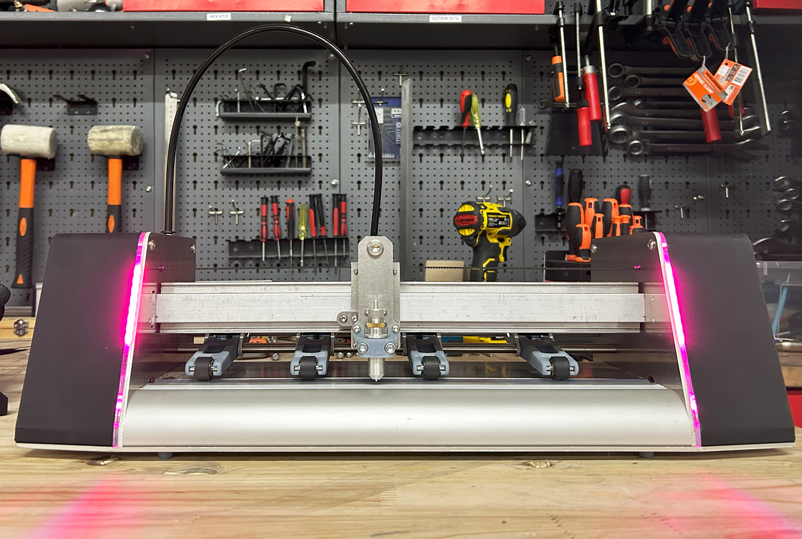
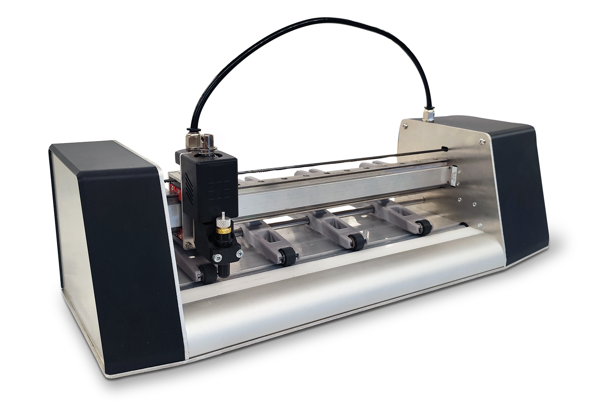

<h1 style=align="center">OLSK Vinyl Cutter V3</h1>

<i>Open Source Vinyl Cutter - Open Lab Starter Kit</i>

 

The Assembly Manual
--

All OLSK machines are open source and have an assembly manual, the BOM and necessary files available in this repository for replication. The assembly manual is an interactive 3D guide though each step and contains a list of parts, tools and instruction remarks, which follows a logical order to provide a smooth assembly.

- **[Assembly Manual](https://open-lab-starter-kit.github.io/OLSK-Vinyl-Cutter/)**

 

 

Specifications V3
--

- cutting area: A3
- frame: CNC milled 3mm aluminum 
- motion: Belt and linear guide
- drivers: TMC drivers with 1/256 microstepping interpolation
- decoupled motors
- continuous duty solenoid
- pinch rollers: 4 units with bistable locking mechanism
- indicator lights
- software: OLOS
- job preview
- file manager

Files
--

- **[CAD](cad)**
- **[Firmware](firmware)**
- **[Wiring Schematic](OLSK_Vinyl_Cutter_V3_WiringSchematic.pdf)**

Author
--

 

OLSK Vinyl Cutter has been designed and built by **[InMachines Ingrassia GmbH](https://www.inmachines.net/)**.

Machine design:
- **[Wilhelm Schütze](http://fabacademy.org/archives/2015/sa/students/schutze.wilhelm/index.html)**

The machine is part of the **[Open Lab Starter Kit (OLSK)](https://www.inmachines.net/open-lab-starter-kit)** group of open source digital fabrication machines.

OLSK is developed by **[InMachines Ingrassia GmbH](https://www.inmachines.net/)** for the **[Dtec project](https://dtecbw.de/home/forschung/hsu/projekt-fabcity)** at **[Fab City Hamburg](https://www.fabcity.hamburg/en/)**.

OLSK Partners:
  

Contact
--

- daniele@inmachines.net
- [https://www.inmachines.net/](https://www.inmachines.net/)

License
--

Hardware design, CAD and PCB files, BOM, settings and other technical or design files are released under the following license:

- CERN Open Hardware Licence Version 2 Weakly Reciprocal - **[CERN-OHL-W](LICENSE_CERN_OHL_W_V2.txt)**

Assembly manual, pictures, videos, presentations, description text and other type of media are released under the following license:

- Creative-Commons-Attribution-ShareAlike 4.0 International - **[CC BY-SA 4.0](LICENSE_CC_BY_SA_4.0.txt)**

Previous version
--

The previous versions of OLSK machines will always be available. 

**[OLSK Vinyl Cutter V2 Repository](OLSK_Vinyl_Cutter_V2)** 

**[OLSK Vinyl Cutter V1 Repository](OLSK_Vinyl_Cutter_V1)** 

